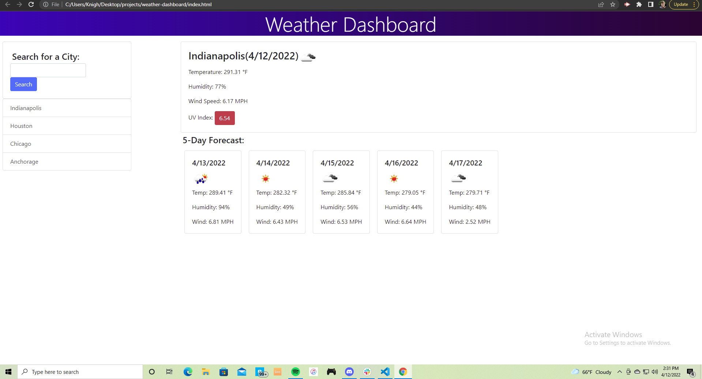

# weather-dashboard

- Typing a city into the input field and clicking search will yield weather results
- A large card at the top of the page will display the current weather
- Underneath the current weather a five day forecast is displayed
- previously searched cities will remain on the side below search

### Live Link Deployed Here: 
- https://alknight17.github.io/weather-dashboard/

### Screenshot of Application
